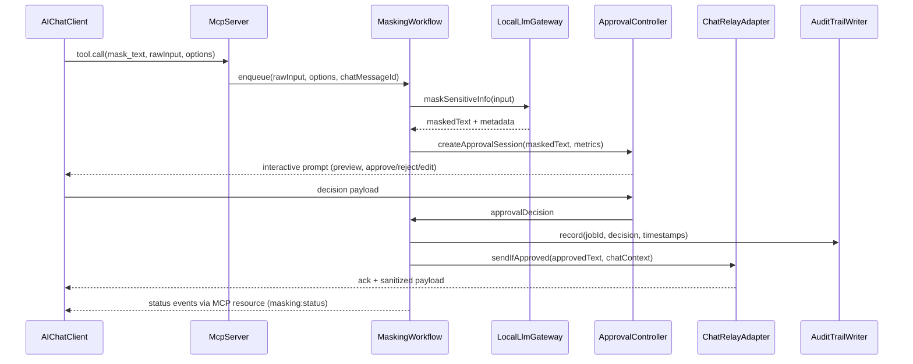
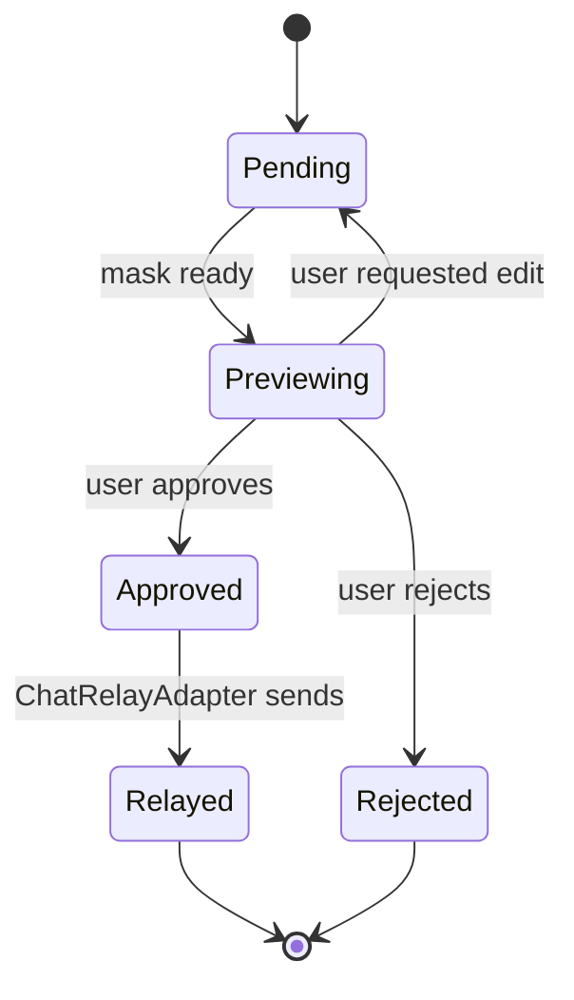
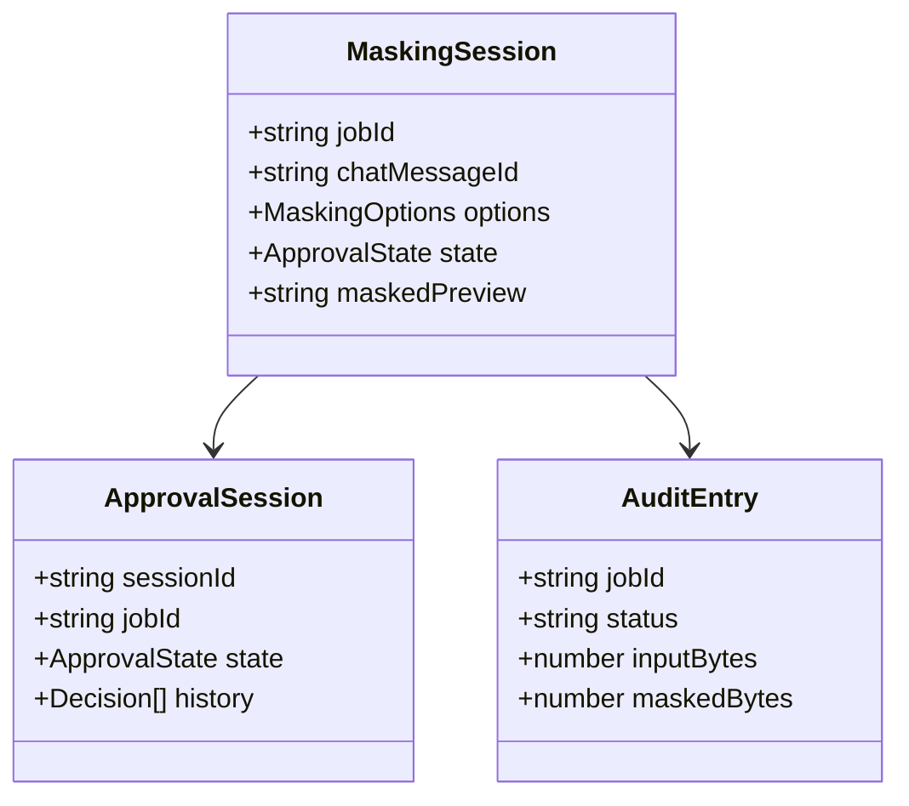

# Design Document

## Overview
Mask-Cut MCP アプリは、AI チャットクライアント (Claude Desktop / Cursor など MCP 対応フロントエンド) に対して、送信テキストをローカル LLM でオフラインマスキングし、ユーザー承認後にのみ外部チャット AI へ中継するゲートウェイを提供する。既存 CLI/Electron と同じ `@mask-cut/text-llm-core` ユースケースを再利用しつつ、MCP のツールインターフェースを通じてセキュアなワークフローを実現する。

**Purpose**: マルチクライアント戦略に沿って apps 配下へ新たな MCP アプリを追加し、ローカル LLM を活用したマスキングと承認プロセスを提供することで、個人情報を含むチャットメッセージを安全に AI へ渡せるようにする。

**Users**: MCP 対応チャットツールを利用する開発者・オペレーターが、送信前マスキングと承認を求められるワークフローで使用する。

**Impact**: apps ディレクトリに `apps/mcp` を追加し、pnpm ワークスペースに新アプリを登録。マスキングジョブ管理・監査ログ・環境変数ルールを既存クライアントと揃えた新しいサービス境界を形成する。

### Goals
- MCP ツール/リソースを提供する Node.js アプリを apps 配下に新設し、pnpm ビルド/テスト/ lint フローへ統合する。
- ローカル LLM (Ollama / llama.cpp 等) を `LLMClient` ポート経由で呼び出し、外部ネットワークを介さずにマスキング結果を生成する。
- ユーザー承認が完了するまでチャット AI への転送を確実にブロックし、承認イベントを監査ログへ記録する。
- `masking:status` イベントと `AuditLogger` で処理状態を可視化し、既存エラーコード (`E_NETWORK` など) を踏襲する。

### Non-Goals
- リモート LLM (OpenAI 等) へのフォールバック実装は範囲外 (常にローカル LLM を利用する)。
- 専用 GUI を提供せず、承認 UI は MCP クライアントまたは CLI/TUI へのフックのみを支援する。
- 既存 CLI/Electron の設定ストアをリファクタリングすることは目的外 (必要なロジックをコピー/薄い再利用に留める)。
- チャット AI 側の応答レンダリングや履歴管理は対象外 (承認済みテキストの転送までを責務とする)。

## Architecture

### Existing Architecture Analysis
- コアマスキングロジックは `@mask-cut/text-llm-core` の `maskSensitiveInfo` + `LLMClient` 抽象で提供され、複数アプリから再利用されている。
- Electron アプリの `MaskingService`/`MaskingJobQueue`/`MaskingCache` がジョブ制御・ステータス放送のパターンを示しており、MCP アプリでも同じイベントモデル (`masking:status`, `locked` フラグ) を継承する。
- CLI アプリの `ConfigService`/`AuditLogger` が JSON Lines 監査ログと `MASK_CUT_*` 環境変数の初期値を扱う。MCP も似た設定/監査ストアを持つ必要がある。
- 既存アプリはいずれも Node.js / TypeScript ベースで、pnpm ワークスペース・tsup ビルド・lint/test スクリプトを共有するため、新アプリも同じパターンに従う。

### Architecture Pattern & Boundary Map
```mermaid
graph LR
  ChatClient[AI chat client (MCP)] -->|tool call| McpServer
  McpServer -->|invoke| MaskingWorkflow
  MaskingWorkflow -->|enqueue| MaskingJobQueue
  MaskingWorkflow -->|LLMClient| LocalLlmGateway
  MaskingWorkflow -->|preview| ApprovalController
  ApprovalController -->|prompt| UserApprovalTransport
  ApprovalController -->|decision| MaskingWorkflow
  MaskingWorkflow -->|audit| AuditTrailWriter
  MaskingWorkflow -->|status| StatusBroadcaster
  MaskingWorkflow -->|approved text| ChatRelayAdapter
  ChatRelayAdapter -->|deliver| ChatAIEndpoint
  ConfigurationService -->|settings/vault/model registry| McpServer
  LocalModelRegistry -->|path validation| LocalLlmGateway
```

- **Selected pattern**: Hexagonal / ports & adapters。`MaskingWorkflow` を中心に MCP インターフェース、ローカル LLM、チャットリレー、承認 UI をアダプターとして接続。
- **Domain boundaries**: `MaskingWorkflow` (アプリケーションサービス) と `LocalLlmGateway`/`ApprovalController`/`ChatRelayAdapter`/`ConfigurationService` (アダプター) を分離し、`LLMClient`/`ApprovalTransport`/`ChatRelayService` ポートで依存を逆転。
- **Existing patterns preserved**: `MaskingJobQueue` ステータスイベント、`AuditLogger` JSON Lines、`MASK_CUT_*` シード、`SecureStoreAdapter` によるキー保護。
- **New components rationale**: MCP 固有の `McpServerBootstrap`, ローカルモデル検証を担う `LocalModelRegistry`, 承認ステート管理 `ApprovalController`, 承認済みテキストを外部チャットへ送る `ChatRelayAdapter`。
- **Steering compliance**: apps/* に薄いクライアント、packages/* のロジック再利用、TypeScript strict、イベント駆動 UX の原則を維持。

### Technology Stack
| Layer | Choice / Version | Role in Feature | Notes |
|-------|------------------|-----------------|-------|
| Frontend / CLI | MCP 対応チャットクライアント (例: Claude Desktop) | 承認 UI をモーダル/対話で表示し、tool 呼び出しを行う | 外部依存・変更なし。MCP tool 応答フォーマットに準拠。
| Backend / Services | Node.js 20 + TypeScript 5 + `@modelcontextprotocol/sdk` | MCP サーバー実装、tool ハンドラ、resource 提供 | `pnpm --filter apps/mcp` でビルド/テスト。
| Data / Storage | JSON Lines 監査ログ、`MaskingCache` (in-memory / optional file)、`LocalModelRegistry` 用の設定 JSON | 操作履歴と最新マスク結果を保持 | 監査ログは CLI と同じ `AuditLogger` 形式を再利用。
| Messaging / Events | `masking:status` EventEmitter, MCP interactive prompts | 処理状態配信 + ユーザー承認のフロー制御 | ステータス payload は Electron と互換。
| Infrastructure / Runtime | Local LLM backend (Ollama HTTP / llama.cpp CLI), SecureStore/keytar, filesystem | ローカルモデル推論とシークレット管理 | `MASK_CUT_*` で既定値を読み込み、ローカルディレクトリ検証を追加。

## System Flows

### Flow 1: マスキング + 承認 + チャット転送

- `MaskingWorkflow` はジョブ単位で `MaskingJobQueue` に投入しつつ、ローカル LLM 実行完了まで `locked` を TRUE に維持。
- `ApprovalController` は MCP interactive API を利用してユーザー入力を取得し、`ApprovalStateMachine` で承認/再編集/拒否を管理。
- `ChatRelayAdapter` は承認済みテキストのみ既定のチャット AI エンドポイントへ転送し、拒否時は `E_USAGE` を返却。

### Flow 2: 承認ステートマシン

- `Pending`: マスク完了待ち。ステータスは `queued`/`running`。
- `Previewing`: マスク結果表示中。ユーザー操作が必要。
- `Approved`: 明示承認済み。`ChatRelayAdapter` へハンドオフ。
- `Relayed`: 転送完了。監査ログに `approvedAt` + `relayedAt` を固定。
- `Rejected`: ユーザー拒否。`MaskingWorkflow` が `E_USAGE` を返しチャット送信を中止。

## Requirements Traceability
| Requirement | Summary | Components | Interfaces | Flows |
|-------------|---------|------------|------------|-------|
| 1.1 | pnpm ワークスペース参加と package scaffolding | McpServerBootstrap, ConfigurationService | Build scripts (`package.json`), tsconfig extends | — |
| 1.2 | `pnpm install` で依存が解決される | McpServerBootstrap | pnpm workspace linking | — |
| 1.3 | `@mask-cut/text-llm-core` 利用 | MaskingWorkflow, LocalLlmGateway | `LLMClient`, `maskSensitiveInfo` | Flow 1 |
| 1.4 | `pnpm --filter apps/mcp build` 失敗時の診断 | McpServerBootstrap | tsup build script、tsc lint | — |
| 2.1 | ローカル LLM でマスク実行 & メタ付きレスポンス | MaskingWorkflow, LocalLlmGateway | `LocalLlmBackend`, `LLMClient` | Flow 1 |
| 2.2 | 処理中はネットワーク送信禁止 | MaskingWorkflow, LocalModelRegistry | `LocalLlmBackend` (engine conf) | Flow 1, State Machine |
| 2.3 | エラーを既存コードに正規化 | MaskingWorkflow | `MaskingJobQueue` result mapping | Flow 1 |
| 2.4 | `masking:status` 互換の進捗配信 | StatusBroadcaster (MaskingWorkflow 内) | Event emitter contract | Flow 1 |
| 3.1 | `MASK_CUT_*` 既定値読み込み | ConfigurationService | Env reader interface | — |
| 3.2 | 設定欠落時の起動拒否 | ConfigurationService, LocalModelRegistry | Validation contract | — |
| 3.3 | ログ/テレメトリで秘匿情報をマスク | AuditTrailWriter | Audit schema | Flow 1 |
| 3.4 | 成功時の監査エントリ | AuditTrailWriter | JSON Lines output contract | Flow 1 |
| 3.5 | ローカルモデルパス検証 | LocalModelRegistry | Filesystem validator | — |
| 4.1 | ローカル LLM 完了 -> プレビュー提示 | MaskingWorkflow, ApprovalController | `ApprovalTransport` | Flow 1 |
| 4.2 | 承認前は転送保留 & ステータス反映 | ApprovalController, StatusBroadcaster | `ApprovalState` events | Flow 2 |
| 4.3 | ユーザーが拒否/再編集可能 | ApprovalController | `ApprovalDecision` contract | Flow 2 |
| 4.4 | 承認後のみ送信 + 監査追記 | ChatRelayAdapter, AuditTrailWriter | `ChatRelayService` | Flow 1 |

## Components and Interfaces

### Summary Table
| Component | Domain/Layer | Intent | Req Coverage | Key Dependencies (P0/P1) | Contracts |
|-----------|--------------|--------|--------------|---------------------------|-----------|
| McpServerBootstrap | Infrastructure | 起動・MCP tool/resource 登録・DI 初期化 | 1.1,1.2,1.4,4.1 | MaskingWorkflow (P0), ConfigurationService (P0), `@modelcontextprotocol/sdk` (P0) | Service ✅ / API ✅ / Event ✅ / Batch ☐ / State ☐ |
| ConfigurationService | Infrastructure | `MASK_CUT_*` シード、設定バリデーション、vault/API-key 管理 | 1.1,3.1,3.2,3.5 | SecureStoreAdapter (P0), LocalModelRegistry (P0), filesystem (P1) | Service ✅ / API ☐ / Event ☐ / Batch ☐ / State ✅ |
| LocalModelRegistry | Domain | ローカル LLM モデル/エンジン設定の検証・メタ保持 | 2.2,3.5 | fs (P0) | Service ✅ / API ☐ / Event ☐ / Batch ☐ / State ✅ |
| MaskingWorkflow | Application | ジョブ受付、`maskSensitiveInfo` 実行、ステータス配信、承認進行 | 1.3,2.*,4.* | MaskingJobQueue (P0), LocalLlmGateway (P0), ApprovalController (P0), AuditTrailWriter (P1) | Service ✅ / API ✅ / Event ✅ / Batch ✅ / State ✅ |
| LocalLlmGateway | Adapter | ローカル LLM backend (Ollama/llama.cpp) を `LLMClient` として提供 | 2.1,2.2,2.3 | LocalModelRegistry (P0), child process/HTTP client (P1) | Service ✅ / API ☐ / Event ☐ / Batch ☐ / State ☐ |
| ApprovalController | Application | MCP interactive セッション管理、承認ステートマシン制御 | 4.1-4.3 | ApprovalTransport (P0), MaskingWorkflow (P0) | Service ✅ / API ✅ / Event ✅ / Batch ☐ / State ✅ |
| ApprovalTransport | Adapter | CLI/MCP クライアントへの対話 I/O を抽象化 | 4.1-4.3 | MCP interactive channel (P0) | Service ✅ / API ✅ / Event ☐ / Batch ☐ / State ☐ |
| ChatRelayAdapter | Adapter | 承認済みテキストを既定チャット AI へ送信 | 4.4 | HTTP/WebSocket client (P1), AuditTrailWriter (P1) | Service ✅ / API ✅ / Event ☐ / Batch ☐ / State ☐ |
| AuditTrailWriter | Infrastructure | JSON Lines 監査ログ記録、マスク済みテレメトリを保持 | 3.3,3.4,4.4 | filesystem (P0), `AuditLogger` (P0) | Service ✅ / API ☐ / Event ☐ / Batch ☐ / State ✅ |

### Component Details

#### Component: McpServerBootstrap
- **Domain/Layer**: Infrastructure (apps/mcp/src/index.ts)
- **Responsibilities**: pnpm scriptsのエントリーポイント。`@modelcontextprotocol/sdk` で MCP server を起動し、`mask_text` ツールと `masking:status` リソースを登録。DI で `MaskingWorkflow` や設定を注入し、プロセス終了時にクリーンアップ。
- **Requirements**: 1.1,1.2,1.4,4.1
- **Dependencies**:
  | Dependency | Direction | Purpose | Criticality |
  |------------|-----------|---------|-------------|
  | ConfigurationService | Inbound | 起動前に設定検証/読込 | P0 |
  | MaskingWorkflow | Outbound | tool 呼び出しのオーケストレーション | P0 |
  | `@modelcontextprotocol/sdk` | External | MCP server 実装 | P0 |
  | ApprovalTransport | Outbound | interactive prompt を MCP チャネルへ橋渡し | P1 |
- **Contracts**: Service ☑ / API ☑ / Event ☑ / Batch ☐ / State ☐

##### API Contract (MCP tool `mask_text`)
| Method | Endpoint | Request | Response | Errors |
|--------|----------|---------|----------|--------|
| tool `mask_text` | MCP tool call | `{ inputText: string, options?: MaskingOptions, chatMessageId?: string }` | `{ approvalSessionId: string, previewToken: string, statusResource: "masking:status" }` | `E_USAGE` (validation), `E_INTERNAL`, `E_TIMEOUT`, `E_MASK_FAILED` |

##### Event Contract (`masking:status` resource)
- Published events: `{ jobId, state, maskedText?, model, endpoint, locked, message?, errorCode? }`
- Subscribed events: MCP client polls/streams the resource
- Delivery guarantee: in-process EventEmitter (best-effort) with last snapshot cached in `MaskingCache` for new subscribers

##### Implementation Notes
- MCP server binds to `localhost` only。TLS/認証は MCP クライアントに委譲。
- Tool 失敗時には `ErrorDomainMapper` (CLI と同種) を再利用し、MCP エラーコードを要件の文字列にマッピング。
- `pnpm --filter apps/mcp build` は tsup で CJS/ESM を生成し、エラー時に stack trace を保持。

#### Component: ConfigurationService
- **Domain/Layer**: Infrastructure
- **Responsibilities**: `MASK_CUT_*` 環境変数から seed を構築し、`apps/mcp/config/settings.json` を読み書き。`SecureStoreAdapter` で API キーを管理し、`LocalModelRegistry` へ engine/prompt/model path を連携。
- **Requirements**: 1.1,3.1,3.2,3.5
- **Dependencies**:
  | Dependency | Direction | Purpose | Criticality |
  |------------|-----------|---------|-------------|
  | SecureStoreAdapter | Outbound | API キーの保存/取得 | P0 |
  | LocalModelRegistry | Outbound | モデル設定の検証 | P0 |
  | filesystem | Outbound | settings.json 永続化 | P1 |
- **Contracts**: Service ☑ / API ☐ / Event ☐ / Batch ☐ / State ☑

##### Service Interface
```typescript
interface McpSettingsRecord {
  endpointLabel: string;
  logFile?: string;
  timeoutMs: number;
  localModel: LocalModelConfig;
}

interface ConfigurationService {
  load(): Promise<McpSettingsRecord>;
  validate(input: Partial<McpSettingsRecord>): Promise<void>;
  save(input: McpSettingsRecord, apiKey?: string): Promise<void>;
}
```
- **Preconditions**: `localModel.modelPath` は `file://` or 絶対パス。`timeoutMs > 0`。
- **Postconditions**: 保存時に `LocalModelRegistry` でパス/engine を検証し、API キーは vault へ格納。
- **Invariants**: 設定ファイルと vault の vaultKeyId が常に同期。
- **Implementation Notes**: CLI `ConfigStore` と同様に JSON schemaVersion を保持。環境変数が欠落しても `validate` で詳細なエラーを返す。

#### Component: LocalModelRegistry
- **Domain/Layer**: Domain service
- **Responsibilities**: ローカル LLM モデル定義 (engine, modelPath, context window, GPU 設定) を registry として管理し、存在確認/アクセス許可判定/ウォームアップ命令を提供。
- **Requirements**: 2.2,3.5
- **Dependencies**: filesystem (stat/read) — P0
- **Contracts**: Service ☑ / API ☐ / Event ☐ / Batch ☐ / State ☑

##### Service Interface
```typescript
interface LocalModelConfig {
  engine: 'ollama' | 'llamaCpp' | 'customScript';
  modelPath: string; // directory or binary path
  modelName?: string; // for ollama
  contextSize?: number;
}

interface LocalModelRegistry {
  resolveActiveConfig(): Promise<LocalModelConfig>;
  assertOfflineMode(config: LocalModelConfig): Promise<void>;
}
```
- **Preconditions**: `modelPath` は存在し、読み取り可能。
- **Postconditions**: `assertOfflineMode` は HTTP/HTTPS URI を拒否し、`customScript` では allowed ディレクトリホワイトリストに一致すること。
- **Implementation Notes**: `llamaCpp` の場合はバイナリ実行権限、`ollama` の場合は `localhost:11434` 以外を拒否。

#### Component: MaskingWorkflow
- **Domain/Layer**: Application service
- **Responsibilities**: ジョブ受理・`MaskingJobQueue` 投入、`LocalLlmGateway` で `maskSensitiveInfo` 実行、`ApprovalController` との連携、`masking:status` 放送、`AuditTrailWriter` への記録。
- **Requirements**: 1.3,2.*,4.*
- **Dependencies**:
  | Dependency | Direction | Purpose | Criticality |
  |------------|-----------|---------|-------------|
  | MaskingJobQueue | Internal | ジョブの逐次実行 | P0 |
  | LocalLlmGateway | Outbound | ローカル LLM 呼び出し | P0 |
  | ApprovalController | Outbound | プレビュー/承認ワークフロー | P0 |
  | ChatRelayAdapter | Outbound | 承認済みテキスト送信 | P0 |
  | AuditTrailWriter | Outbound | 監査記録 | P1 |
  | StatusBroadcaster | Internal | `masking:status` イベント | P0 |
- **Contracts**: Service ☑ / API ☑ / Event ☑ / Batch ☑ / State ☑

##### Service Interface
```typescript
interface MaskingWorkflow {
  startMasking(input: string, options: MaskingOptions, chatMessageId?: string): Promise<{ jobId: string, approvalSessionId: string }>;
  onStatus(listener: MaskingStatusListener): () => void;
}
```
- **Batch/Job Contract**:
  - Trigger: MCP tool 呼び出し
  - Input: `{ text, options, chatMessageId }`
  - Output: `{ status: 'succeeded' | 'failed', maskedText?, errorCode? }`
  - Idempotency: `jobId` をキーに同一入力再送時はキュー後 tail-drop。`MaskingCache` で最後の結果を保持。
- **Implementation Notes**: `MaskingJobQueue` は既存実装を reuse。`mapError` は Electron 版を流用し `E_NETWORK/E_TIMEOUT/E_MASK_FAILED/E_USAGE` を返す。

#### Component: LocalLlmGateway
- **Domain/Layer**: Adapter (infrastructure)
- **Responsibilities**: `LocalModelRegistry` の設定に基づき `LLMClient` を実装。Ollama HTTP と llama.cpp CLI、custom script (STDIN/STDOUT) をサポートし、常にローカルプロセス内で完結。
- **Requirements**: 2.1,2.2,2.3
- **Dependencies**: LocalModelRegistry (config), child_process/http client — P0/P1
- **Contracts**: Service ☑ / API ☐ / Event ☐ / Batch ☐ / State ☐

##### Service Interface
```typescript
interface LocalLlmBackend {
  warmup(): Promise<void>;
  generate(prompt: LLMRequest): Promise<LLMResponse>;
}
```
- **Preconditions**: `warmup` 成功後のみ `generate` 実行。
- **Postconditions**: 応答中に外部 URL へ転送しない。`raw` には backend 固有メタを格納。
- **Implementation Notes**: Ollama backend は `POST http://127.0.0.1:11434/api/generate`、llama.cpp backend は child process でバイナリ実行。どちらも timeout を `ConfigurationService.timeoutMs` から取得。

#### Component: ApprovalController
- **Domain/Layer**: Application service
- **Responsibilities**: `ApprovalStateMachine` を管理し、`ApprovalTransport` へプレビューと操作を提示。`approve/reject/edit` の決定を `MaskingWorkflow` に通知し、`masking:status` に `state: 'waiting-approval'` を追加する。
- **Requirements**: 4.1-4.3
- **Dependencies**: ApprovalTransport (P0), MaskingWorkflow (inbound), AuditTrailWriter (P1)
- **Contracts**: Service ☑ / API ☑ / Event ☑ / Batch ☐ / State ☑

##### Service Interface
```typescript
type ApprovalDecision =
  | { type: 'approve'; editedText?: string }
  | { type: 'reject'; reason?: string }
  | { type: 'edit'; revisedInput: string };

interface ApprovalController {
  createSession(jobId: string, preview: MaskingResultSnapshot): Promise<{ approvalSessionId: string }>;
  awaitDecision(sessionId: string): Promise<ApprovalDecision>;
}
```
- **Implementation Notes**: `edit` 決定時は `MaskingWorkflow` が再ジョブ投入。`reject` は `E_USAGE` を返却。`ApprovalTransport` が MCP interactive UI, CLI fallback を抽象化。

#### Component: ChatRelayAdapter
- **Domain/Layer**: Adapter
- **Responsibilities**: 承認済みテキストをチャット AI (OpenAI 互換 API など) へ送信。ローカル LLM とは別の outbound 経路だが、承認済みテキストのみ送信し、原文は破棄。
- **Requirements**: 4.4
- **Dependencies**: HTTP/WebSocket client (P1), ConfigurationService (endpoint label), AuditTrailWriter (P1)
- **Contracts**: Service ☑ / API ☑ / Event ☐ / Batch ☐ / State ☐

##### API Contract
| Method | Endpoint | Request | Response | Errors |
|--------|----------|---------|----------|--------|
| `sendApprovedMessage` | Configured chat endpoint | `{ chatMessageId, maskedText, metadata }` | `{ relayId, status }` | `E_NETWORK`, `E_TIMEOUT`, `E_INTERNAL` |

- **Implementation Notes**: Endpoint は環境変数および設定ファイルで指定。`maskedText` 以外の原文を含めない。失敗時は再送せずユーザーへエラーを表示。

#### Component: AuditTrailWriter
- **Domain/Layer**: Infrastructure
- **Responsibilities**: `AuditLogger` をラップし、`jobId`, `inputBytes`, `maskedBytes`, `decision`, `approvedAt`, `relayedAt`, `errorCode` を JSON Lines で記録。ログファイルは設定 or `--log-file` 環境。
- **Requirements**: 3.3,3.4,4.4
- **Dependencies**: filesystem (P0), MaskingWorkflow (events)
- **Contracts**: Service ☑ / API ☐ / Event ☐ / Batch ☐ / State ☑

##### State Management
- **State model**: `AuditEntry` (jobId, timestamps, profile label, masked stats)
- **Persistence**: append-only JSON Lines, rotation by size (configurable)
- **Concurrency**: single writer queueでロック。`maskedText` は redact されたプレースホルダのみ記録。

##### Implementation Notes
- CLI の `AuditLogger` 実装を再利用し、`status: 'approved'|'rejected'` を追加。`rawInput` の保存は禁止。

## Data Models

### Domain Model
- **MaskingSession**: aggregate root。`jobId`, `inputChecksum`, `maskingOptions`, `localModel`, `approvalState`, `maskedPreview`, `chatMessageId` を保持。Invariant: 承認後は `maskedPreview` のみ保持し `rawInput` を破棄。
- **ApprovalSession**: `approvalSessionId`, `jobId`, `state (pending|previewing|approved|rejected|relayed)`, `decisionHistory[]`, `userId`. Invariant: `state=approved` のとき `decisionHistory` の最後は approve。
- **LocalModelConfig**: engine, path, version, warmup metadata。Invariant: path は `file://` かローカル絶対パス。
- **AuditEntry**: `jobId`, `startedAt`, `finishedAt`, `status`, `inputBytes`, `maskedBytes`, `decision`, `errorCode?`, `approvedAt?`, `relayedAt?`。



### Logical Data Model
- **Settings store**: `apps/mcp/config/settings.json`
  - Fields: `endpointLabel`, `timeoutMs`, `localModel { engine, modelPath, modelName }`, `logFile`. JSON schema (versioned) validated by `ConfigurationService`.
- **Audit log**: `<logFile>` JSON Lines. Each line is `AuditEntry` (UTF-8). Append-only.
- **Cache**: `MaskingCache` (in-memory, optional persisted to `apps/mcp/cache.json`). Stores last input hash + result for resuming statuses.
- **Approval session store**: in-memory Map keyed by `approvalSessionId`. Optionally persisted for crash recovery (future work).

**Consistency & Integrity**:
- Settings writes are atomic by writing to temp file then renaming。
- Approval + masking session updates guarded by `MaskingWorkflow` (single-threaded queue) to avoid state races。
- Audit log writes serialized; on failure, tool returns `E_INTERNAL` and logs to stderr.

### Data Contracts & Integration
- **MCP tool request/response**: JSON schema described under McpServerBootstrap.
- **masking:status event schema**: `jobId`, `state`, optional `maskedText` (only after approval), `locked`, `errorCode`. `maskedText` is truncated preview when `state='succeeded'`.
- **Approval prompt payload**: `ApprovalController` sends `preview`, `diff` (if user edited), `metrics { maskedCount, latencyMs }` to MCP interactive UI.
- **Chat relay payload**: `ChatRelayAdapter` sends `maskedText`, `jobId`, `approvedAt`, `model`, `endpointLabel`.

## Error Handling

### Error Strategy
- **Validation errors (E_USAGE)**: 空文字, モデル設定不足, 承認拒否 → 明示メッセージを MCP クライアントへ返し再入力を促す。
- **Network errors (E_NETWORK)**: ローカル HTTP (Ollama) 不達、チャット中継失敗 → 監査ログ記録 + ユーザー通知。
- **Timeouts (E_TIMEOUT)**: `LocalLlmGateway`/チャットリレーの `timeoutMs` 超過。`MaskingWorkflow` がリトライせず失敗応答。
- **Masking failures (E_MASK_FAILED)**: LLM 応答不備/不正 JSON → 再実行案内。
- **Internal errors (E_INTERNAL)**: 予期しない例外, 承認セッション喪失 → `AuditTrailWriter` へ出力し復旧。

### Monitoring
- `masking:status` をチャット側のログにも streaming。
- `AuditTrailWriter` が job/time metrics を JSON Lines へ記録し、外部ログ aggregator へ転送可能。
- Node 健康チェック `/healthz` (ローカルのみ) で queue backlog, local LLM availability, approval session count を返却。
- 重要エラーは `stderr` + optional Sentry DSN (将来) へ送信。

## Testing Strategy
- **Unit Tests**:
  1. `LocalModelRegistry.assertOfflineMode` が HTTP/相対パスを拒否する。
  2. `LocalLlmGateway` が Ollama/llama.cpp backend で `LLMClient` 契約を満たす (fetch/process スタブ)。
  3. `ApprovalController` の状態遷移 (approve/reject/edit) が要件通りに動作する。
  4. `MaskingWorkflow.mapError` が `Error` メッセージから正しいコードを返す。
  5. `ConfigurationService.validate` が `MASK_CUT_*` 未設定時に詳細な検証エラーを返す。
- **Integration Tests**:
  1. MCP tool 呼び出し → マスキング完了 → 承認 → チャットリレーの happy path。
  2. ローカル LLM タイムアウト時に `E_TIMEOUT` を通知するフロー。
  3. 承認拒否時にチャット送信が行われず `AuditEntry.status='rejected'` になる。
  4. `masking:status` resource を購読すると queued→running→waiting→succeeded の順に受信する。
  5. Local model path が無効な場合に MCP サーバー起動が失敗する。
- **E2E/UI Tests**:
  1. MCP インタラクティブ UI (e.g., CLI/TUI) でプレビューが表示され、ユーザーが編集→再マスクできる。
  2. Audit log が CLI 監査解析ツールで読み取れる。
- **Performance/Load Tests**:
  1. 連続 50 ジョブ (同時1) を処理して queue backlog/latency を測定。
  2. 大規模テキスト (最大 10k 文字) のマスキングで `timeoutMs` 内に完了することを確認。

## Security Considerations
- すべてのマスキングはローカル LLM 上で実行し、`LocalModelRegistry.assertOfflineMode` により外部 URL を禁止。
- API キー/シークレットは `SecureStoreAdapter` (keytar) に保存し、ログ/監査にはハッシュ化した識別子のみ記録。
- MCP tool のレスポンスに原文を含めず、`maskedPreview` のみ露出。
- 承認 UI からの `editedText` 入力は再度ローカルマスキングを経ないと送信されない。
- Audit log には `maskedBytes` などの統計のみ記録し、ユーザー入力やチャット本文は保持しない。

## Performance & Scalability
- `MaskingJobQueue` は単一ワーカーで順次処理し、`waitForIdle` API で MCP クライアントが完了を待機可。
- ローカル LLM warmup をアプリ起動時に実行し、初回遅延を吸収。`LocalLlmGateway` がモデルロード状態をキャッシュ。
- `timeoutMs`/`maxConcurrentJobs` を設定で制御 (初期値: 1)。将来的に複数ワーカーに拡張する際も `MaskingWorkflow` のインターフェースを維持。
- 承認待ちセッション数が増えた場合、`ApprovalController` は TTL を設けて自動クリーンアップ。

## Supporting References
- `.kiro/specs/apps-mcp-integration/research.md` — 追加発見と設計根拠。
- `apps/electron-app/src/main/masking/maskingService.ts` — エラー処理・ジョブキューの既存パターン。
- `apps/cli/src/auditLogger.ts` — 監査ログ実装の詳細。
