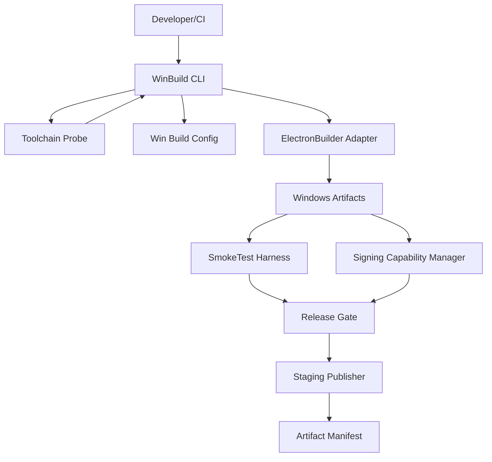
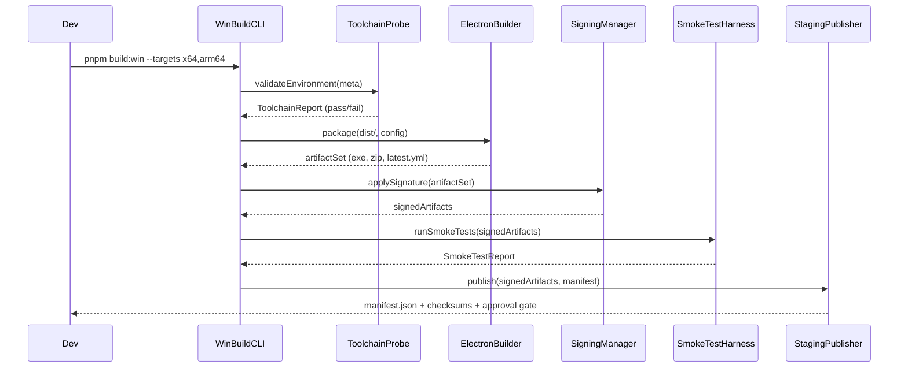
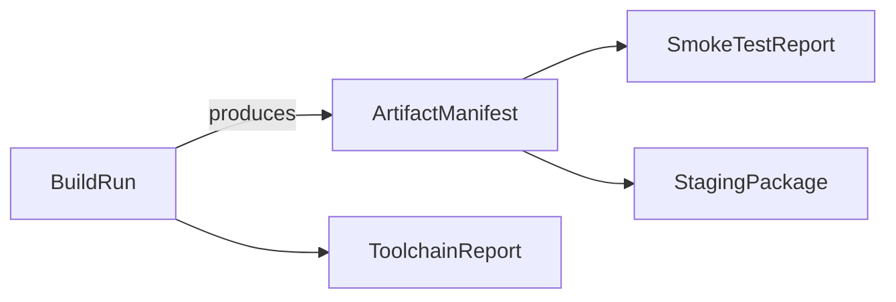

# Design Document

## Overview
Mask-Cut Electron を Windows ネイティブに配布できるよう、既存の TypeScript ビルド出力を Windows 専用パッケージパイプラインへ接続する。新たに設ける WinBuild Orchestrator は、Electron アプリの `dist/` 生成物を入力に、Windows 固有のインストーラー/ポータブル成果物、ハッシュ付きマニフェスト、署名状態を一括管理し、CI やローカル開発者が同じコマンドで再現できる体験を提供する。
主な利用者は (a) リリースエンジニア／CI (b) QA/プロダクトオーナー。彼らは Windows 版の成果物を得るだけでなく、ビルド前提条件の検証や自動スモークテストの結果を判断材料として扱う。従来は `pnpm --filter @mask-cut/electron-app build` が TypeScript トランスパイルまでしか行わず、Windows 用のパッケージや署名、マニフェスト整備が未定義だった。本設計により Windows リリースへの段階的ゲート (検証 → 署名 → スモークテスト → ステージング反映) が実現する。

### Goals
- Windows 向けインストーラー(.exe)とポータブル成果物のビルド設定を単一直列化し、複数アーキテクチャでも共通パラメータで生成できるようにする (1.1, 1.3, 1.4)
- 必須メタデータ・ツールチェーン・署名設定などの前提条件が欠落している場合は即座に検知し、行動可能なエラーで停止させる (1.2, 2.1-2.5)
- ビルド後の成果物検証 (スモークテスト・チェックサム・自動更新マニフェスト) とリリースゲーティングを自動化する (1.5, 3.1-3.5)

### Non-Goals
- macOS / Linux 向けパッケージング (将来は別スペックで扱う)
- フル E2E テストや回帰試験の自動化 (本設計では Windows スモークテストに限定)
- 自動配信 (Electron Auto Update サーバーへの配信はステージング格納まで)

## Architecture

### Existing Architecture Analysis
- 現状の `apps/electron-app` は TypeScript トランスパイルと静的アセットコピーのみで完了し、Electron パッケージングツールは未導入。`dist/main`/`dist/renderer` を生成し、開発時は `electron .` で起動している。
- アプリアイコンは `assets/icon.png` を解決する `getMuscatIcon()` が存在し、パッケージング時も同じアセットを利用できる。既存の `WindowManager` や `MaskingService` などの構造は維持する。
- モノレポ全体は pnpm ワークスペースで、Electron アプリは `@mask-cut/text-llm-core` を参照。この依存を崩さずに Windows パイプラインを追加する。

### Architecture Pattern & Boundary Map
**Selected pattern:** Orchestrated build pipeline (command-line orchestrator + modular validators + artifact services)。既存のビルド成果物を変換する中間ステージング層を追加する。
**Domain boundaries:**
- Build Orchestration: コマンド/設定解析とパイプライン駆動
- Validation & Signing: ツールチェーンチェック、署名鍵の抽象化
- Packaging Adapter: `electron-builder` への委譲、ターゲットアーキテクチャ展開
- Verification & Release Gate: スモークテストと成果物公開



### Technology Stack
| Layer | Choice / Version | Role in Feature | Notes |
|-------|------------------|-----------------|-------|
| Frontend / CLI | `pnpm --filter @mask-cut/electron-app build:win` (新規、Node.js 18 ESM スクリプト) | WinBuild Orchestrator エントリーポイント | PowerShell/Unix 双方から同一 CLI を呼べるよう Node ベースで実装 |
| Backend / Services | `electron-builder@25.x` + `app-builder-lib` | Windows インストーラー(NSIS) / ポータブル(zip)生成 | macOS 依存を避けるため Windows Runner / WSL2 上で実行 |
| Data / Storage | `artifact-manifest.json`, `toolchain-report.json`, `smoke-test-report.json` | 状態追跡とゲート判定 | JSON Schema を `packages/build-schemas` に用意 |
| Messaging / Events | `node:events` based status emitter | 各ステージの進行・停止理由共有 | CLI と CI ログを同期 |
| Infrastructure / Runtime | Windows Server 2022 runner + optional GitHub Actions self-hosted | 署名用 `signtool.exe` や Windows SDK 利用 | ローカル開発も Windows 10/11 を前提 |

## System Flows

説明: ToolchainProbe が失敗した場合は以降をスキップし `artifact-manifest` に `status: "failed"` を記録。SmokeTestHarness で失敗した場合はステージング公開を中断し、ログ/再現手順を `smoke-test-report.json` に添付する。

## Requirements Traceability
| Requirement | Summary | Components | Interfaces | Flows |
|-------------|---------|------------|------------|-------|
| 1.1 | Windows 10+ 向けインストーラー/ポータブル生成 | WinBuildOrchestrator, ElectronBuilderAdapter | `win-build.config.mjs`, `ElectronBuilderRunner` | System Flow main path |
| 1.2 | バージョン未設定時に失敗 | WinBuildOrchestrator, ToolchainProbe | `BuildMetadataReader` | Probe validation |
| 1.3 | ブランド整合性 (名前/アイコン/署名) | ElectronBuilderAdapter, SigningManager | `branding.json`, `signtool` wrapper | Sequence nodes Builder/Sign |
| 1.4 | 複数アーキテクチャ共通設定 | WinBuildOrchestrator, ElectronBuilderAdapter | `TargetMatrix` config | Flow: CLI -> Builder |
| 1.5 | 成果物とハッシュをマニフェスト化 | ArtifactManifestService | `artifact-manifest.json` schema | Flow: Builder -> Stage |
| 2.1 | Node/Electron/SDK バージョン検証 | ToolchainProbe | `toolchain-report.json` | Probe branch |
| 2.2 | 署名設定欠落時の警告/モード選択 | SigningManager | `SigningPolicy` | Flow: CLI -> Sign |
| 2.3 | ネイティブ依存ビルドツールチェック | ToolchainProbe | `DependencyCheck` | Probe |
| 2.4 | ローカル実行向けチェックリスト出力 | ToolchainProbe | `checklist.txt` | Flow: Dev->CLI |
| 2.5 | pnpm lock 差分検知 | LockfileGuard | `pnpm-lock.approved` | Flow: CLI preflight |
| 3.1 | スモークテストで基本機能検証 | SmokeTestHarness | `smoke-test-report.json` | Flow: CLI->Test |
| 3.2 | 失敗時のリリース阻止 | ReleaseGatekeeper | `GateDecision` | Flow: Test -> Stage |
| 3.3 | ステージング保管 + チェックサム公開 | StagingPublisher, ArtifactManifestService | `staging/` layout | Flow: Stage |
| 3.4 | 自動更新マニフェスト更新 | ReleaseGatekeeper | `latest.yml`, `app-update.json` | Flow: Stage |
| 3.5 | 監査ログ生成 | ArtifactManifestService | `audit-log.jsonl` | Flow: Stage |

## Components and Interfaces

### Component Summary
| Component | Domain/Layer | Intent | Requirements | Key Dependencies (P0/P1) | Contracts |
|-----------|--------------|--------|--------------|---------------------------|-----------|
| WinBuildOrchestrator | Build Pipeline | CLI エントリで全ステージを直列実行 | 1.1-1.5,2.1-2.5,3.1-3.5 | P0: ToolchainProbe, ElectronBuilderAdapter, ReleaseGatekeeper / P1: ArtifactManifestService | `build:win` CLI args, `PipelineContext` |
| ToolchainProbe | Validation | ツールチェーン/メタデータ/lockfile を検証 | 1.2,2.1-2.5 | P0: LockfileGuard, MetadataReader / P1: ChecklistEmitter | `ToolchainReport` |
| ElectronBuilderAdapter | Packaging | `electron-builder` 呼び出しとターゲット展開 | 1.1,1.3,1.4 | P0: electron-builder, BrandingConfig / P1: SigningManager | `ElectronBuilderRunner` |
| SigningManager | Validation/Signing | 署名証明書の検証と適用モード制御 | 1.3,2.2 | P0: signtool, Windows SDK | `SigningPolicy`, `SignJob` |
| SmokeTestHarness | Verification | 生成物を e2e スモーク実行し結果を記録 | 3.1,3.2 | P0: Windows sandbox profile / P1: CLI automation harness | `SmokeTestPlan`, `SmokeTestReport` |
| ArtifactManifestService | Release Data | 成果物メタデータ/ハッシュ/監査ログを管理 | 1.5,3.3,3.5 | P0: crypto (sha512), File IO | `artifact-manifest.json` |
| ReleaseGatekeeper & StagingPublisher | Release Control | ステージング領域配備・latest.yml 更新 | 3.2-3.4 | P0: SmokeTestHarness, ArtifactManifestService | `GateDecision`, `staging.json` |

### Build Pipeline Layer

#### WinBuildOrchestrator
| Field | Detail |
|-------|--------|
| Intent | CLI から build → validate → package → verify → publish を管理する |
| Requirements | 1.1-1.5,2.1-2.5,3.1-3.5 |

**Responsibilities & Constraints**
- `pnpm --filter @mask-cut/electron-app build:win [--targets x64,arm64] [--signing required|allow-skip]` を解析し、`PipelineContext` を生成。
- 直列フェーズ: `ToolchainProbe -> ElectronBuilderAdapter -> SigningManager -> SmokeTestHarness -> ReleaseGatekeeper -> ArtifactManifestService`。各フェーズでイベントを発火し CI ログへ JSON Lines を書き込む。
- `build.meta.json` を読み込み、アプリバージョンやチャネルを `package.json` と突き合わせ。欠落時は即座にフェイル。

**Interfaces**
```ts
interface PipelineContext {
  version: string;
  targets: Array<'x64' | 'arm64'>;
  channel: 'beta' | 'stable';
  signingMode: 'required' | 'allow-skip';
  distDir: string;
  artifactsDir: string;
}
```
- 入力: CLI 引数 + `apps/electron-app/package.json`。
- 出力: `artifact-manifest.json`, `toolchain-report.json`, exit code。

**Implementation Notes**
- 失敗時でも `artifact-manifest.json` に `status` と `failedStep` を記録。
- `pnpm-lock.yaml` のハッシュを `LockfileGuard` から受取り、CI アーティファクトへ添付。

#### ToolchainProbe
| Field | Detail |
|-------|--------|
| Intent | 実行環境の前提条件を検証しレポート化 |
| Requirements | 1.2,2.1-2.5 |

**Responsibilities & Constraints**
- Node/Electron/Electron Builder バージョンを `package.json` と `pnpm list` から抽出し、許容範囲を `win-build.config.mjs` で宣言。
- Windows SDK, Visual C++ Build Tools, `signtool.exe` の存在チェック (PowerShell `Get-Command` / `where.exe`).
- `LockfileGuard` で `pnpm-lock.yaml` の SHA-256 を算出し、`pnpm-lock.approved` (コミット済み) と一致しなければ失敗。
- ローカル環境実行時は `checklist.txt` を `artifacts/windows/<version>/` に出力し、足りない項目を列挙。

**Interfaces**
```ts
interface ToolchainReport {
  status: 'pass' | 'fail';
  issues: Array<{code: 'NODE_VERSION' | 'ELECTRON_BUILDER' | 'WINDOWS_SDK' | 'LOCKFILE_DRIFT'; detail: string}>;
  versions: {
    node: string;
    electron: string;
    electronBuilder: string;
    windowsSDK?: string;
  };
  checklist: string[];
}
```

#### ElectronBuilderAdapter
| Field | Detail |
|-------|--------|
| Intent | `electron-builder` を設定ファイルから実行し成果物セットを返す |
| Requirements | 1.1,1.3,1.4 |

**Responsibilities & Constraints**
- 新規ファイル `apps/electron-app/build/win/electron-builder.config.cjs` を読み込み、`nsis` ターゲットと `portable` ターゲットを同時生成。
- `branding.json` (アプリ名、会社名、copyright、アイコンパス) を `assets/icon.png` に紐付。
- `TargetMatrix` により `x64`/`arm64`/`ia32` を設定し、未指定アーキテクチャはスキップ。
- 生成物: `MaskCutSetup-x64.exe`, `MaskCutPortable-arm64.zip`, `latest.yml` (auto-update manifest)。

**Interfaces**
```ts
interface ElectronBuilderRunner {
  run(ctx: PipelineContext): Promise<ElectronArtifactSet>;
}
interface ElectronArtifactSet {
  targets: Array<{arch: 'x64'|'arm64'; installer: string; portable: string}>;
  updateManifestPath: string; // latest.yml
}
```

#### SigningManager
| Field | Detail |
|-------|--------|
| Intent | 署名証明書の検証と `signtool.exe` 呼び出し |
| Requirements | 1.3,2.2 |

**Responsibilities**
- 環境変数 `WINDOWS_SIGNING_CERT_PATH`, `WINDOWS_SIGNING_CERT_PASSWORD` を読み込み。未設定の場合、`signingMode==='required'` なら失敗、`allow-skip` ならメタデータに `unsigned` を記録。
- `SignJob` 定義: `artifactPath`, `timestampServer`, `digestAlgorithm`. 署名結果は `signatures.json` でハッシュ化。

**Interfaces**
```ts
interface SigningPolicy {
  mode: 'required' | 'allow-skip';
  certificatePath?: string;
  passwordEnv?: string;
  timestampUrl: string;
}
```

### Verification & Release Layer

#### SmokeTestHarness
| Field | Detail |
|-------|--------|
| Intent | 生成済み exe/zip を GUI レスで起動し主要機能を検証 |
| Requirements | 3.1,3.2 |

**Responsibilities**
- PowerShell スクリプト or Node 子プロセスで exe を `--smoke-test` フラグ付きで起動し、preload 層に `SMOKE_TEST_MODE=1` を渡す (アプリ側で内部 self-check を実装予定)。
- 手順: 起動 → 設定保存 API にモック環境変数を投入 → `masking:run` を呼び `locked` → `result` まで追跡 → 成功で終了コード 0。
- 結果を `smoke-test-report.json` に書き込み、失敗時はスクリーンショット/ログパスを添付。

#### ArtifactManifestService
| Field | Detail |
|-------|--------|
| Intent | 成果物メタデータと監査ログを生成 |
| Requirements | 1.5,3.3,3.5 |

**Responsibilities**
- `artifact-manifest.json` スキーマ:
```ts
interface ArtifactManifest {
  version: string;
  channel: 'beta' | 'stable';
  status: 'succeeded' | 'failed';
  artifacts: Array<{type: 'installer'|'portable'; arch: 'x64'|'arm64'; file: string; sha512: string; signed: boolean}>;
  updateManifest: {file: string; sha512: string};
  smokeTestReport?: string;
  toolchainReport: string;
  generatedAt: string;
}
```
- `audit-log.jsonl` に各フェーズの開始/終了時刻、担当者、git SHA を追記。

#### ReleaseGatekeeper & StagingPublisher
| Field | Detail |
|-------|--------|
| Intent | スモークテスト結果をもとにステージング公開と `latest.yml` 更新を制御 |
| Requirements | 3.2-3.4 |

**Responsibilities**
- `GateDecision` アルゴリズム: `toolchainReport.status === 'pass'` かつ `smokeTestReport.status === 'pass'` の場合のみ `staging/<version>/` に成果物を配置。
- `latest.yml` 内の URL を `STAGING_BASE_URL` に書き換え、`app-update.json` (Electron auto-update JSON) も同時に生成。
- `sha512` を `crypto` モジュールで算出し、ステージング CDN へアップロード(設計上はローカル `artifacts/staging` ディレクトリ、CI では GitHub Actions artifact / Azure Blob へ同期)。

## Data Models

### Domain Model
- Aggregates: `BuildRun` (単一ビルド実行)、`Artifact`、`VerificationReport`。`BuildRun` は `PipelineContext` + `ToolchainReport` + `ArtifactManifest` を保持。
- Domain events: `BuildStarted`, `ProbeFailed`, `ArtifactsSigned`, `SmokeTestCompleted`, `GateResultPosted`。



### Logical Data Model
- `ToolchainReport` (JSON): `status`, `issues[]`, `versions`, `checklist`. Natural key = `buildId`.
- `ArtifactManifest` (JSON): `artifacts[]`, `hashes`, `status`, `references`. Natural key = `version + channel`.
- `SmokeTestReport` (JSON): `status`, `scenarios[]`, `logsPath`, `screenshots[]`.
- `StagingIndex` (JSON): `releases[]` {version, channel, urlInstaller, urlPortable, sha512Installer, sha512Portable, date}.

### Data Contracts & Integration
- `win-build.config.mjs`: exports `const targets`, `const toolchain = { node: '>=18.18', electron: '^28', electronBuilder: '^25' }`, `const signing = { timestampUrl: 'http://timestamp.digicert.com' }`.
- `BuildMetadataReader` expects `apps/electron-app/build/meta.json` with `version`, `channel`, `releaseNotesPath`.
- `app-update.json` contract:
```json
{
  "version": "0.1.0",
  "files": [
    { "url": "MaskCutSetup-x64.exe", "sha512": "..." }
  ],
  "path": "MaskCutSetup-x64.exe",
  "sha512": "...",
  "releaseDate": "2025-11-12T09:00:00Z"
}
```

## Error Handling

### Error Strategy
- 各フェーズで専用例外クラス (`ToolchainError`, `PackagingError`, `SigningError`, `SmokeTestError`) を定義し、Orchestrator が catch → `artifact-manifest` へ転記。
- フェーズ間はフェイルファスト。失敗以降のフェーズは実行しない。

### Error Categories and Responses
- **User Errors (4xx-equivalent)**: バージョン未設定・lockfile 差分 → CLI exit code 10 + checklist。署名パス未設定 (allow-skip) → exit 0 だが manifest に `unsigned` を記録。
- **System Errors**: electron-builder 実行失敗・disk full → exit code 20、`PackagingError` ログと再実行指針。
- **Business Logic Errors**: スモークテスト失敗 → exit code 30、`GateDecision=blocked`。

### Monitoring
- CLI は JSON Lines を `artifacts/logs/win-build.log` に出力し、CI ではアーティファクト化。
- `audit-log.jsonl` を集約し、今後の監査やサポート問い合わせの一次情報にする。

## Testing Strategy
- **Unit**: `ToolchainProbe` のバージョン境界テスト、`LockfileGuard` のハッシュ比較、`SigningManager` のモード分岐、`ArtefactManifestService` のハッシュ計算。
- **Integration**: `WinBuildOrchestrator` happy path (モック builder/signing/tester)、`ToolchainProbe + LockfileGuard` 実ファイル差分、`ReleaseGatekeeper` での `latest.yml` 更新確認。
- **E2E/UI**: スモークテストハーネスが exe を起動し `maskingAPI`→`settingsAPI` を叩くルート、CLI から `--targets x64,arm64` を指定した多アーキテクチャ生成。
- **Performance/Load**: 署名処理の並列化 (最大2並列まで)、大きなアセット (100MB 超) に対するハッシュ計算計測、CI タイムアウト設定 (30 分上限)。

## Security Considerations
- 署名証明書は CI では Azure Key Vault/ GitHub OIDC からダウンロードし、一時ファイルとして `SecureStoreAdapter` 相当の暗号化ストアに一時保存して直後に削除。
- `artifact-manifest.json` には API キー等のシークレットを含めない。署名パスワードは環境変数参照のみ。
- スモークテストで使用する設定情報はモックエンドポイント/トークンを使い、本番 API キーを扱わない。

## Performance & Scalability
- 多アーキテクチャ構成では `electron-builder` を `--parallel` で実行するが、メモリ上限 (8GB) を超えないよう 2 ターゲットまで同時実行。さらなるターゲットが必要になった場合はキュー制御を `TargetMatrix` に追加。
- チェックサム計算はストリーミングで行い、大容量ファイルをメモリに読み込まない。

